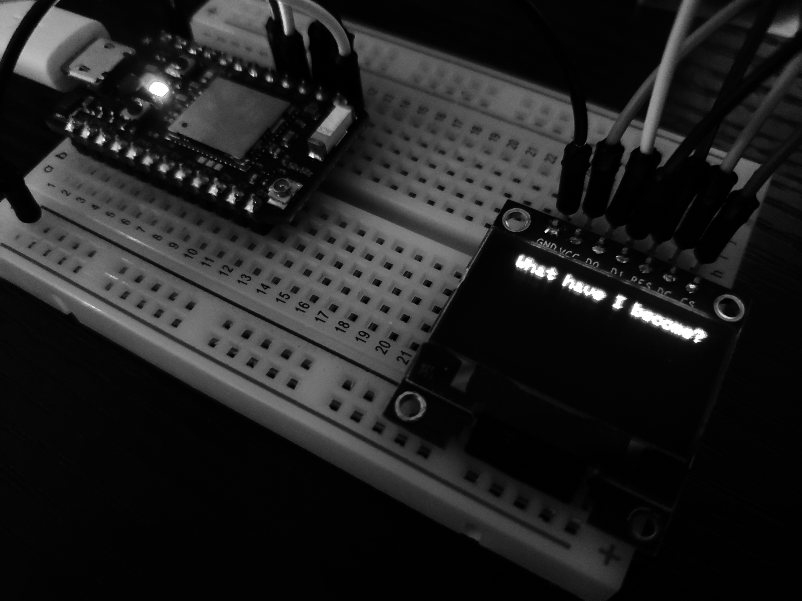

# Riverstone

Riverstone is a small Spark Photon that I am building out as an environment sensor. It will soon monitor air quality, environment toxicity, and temperature.

## Devices
* Hypnos - Particle Photon Wi-Fi board
* Poseidon - Particle Argon Wi-Fi / Mesh Gateway
* Hades - Particle Xenon Mesh Endpoint
* Nemesis - Particle Xenon Mesh Endpoint

* Screen enabled
* Todo: configure CO, Alcohol, and VOC gas sensor
* Todo: configure Digital Temperature and Humidity measure sensor
* Todo: configure Dust sensor
* Todo: configure Solar Panel

